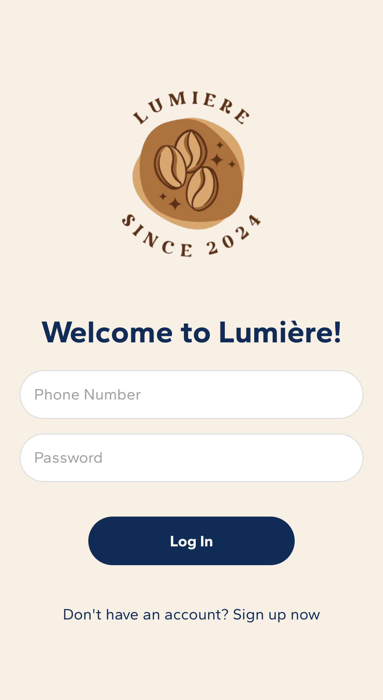
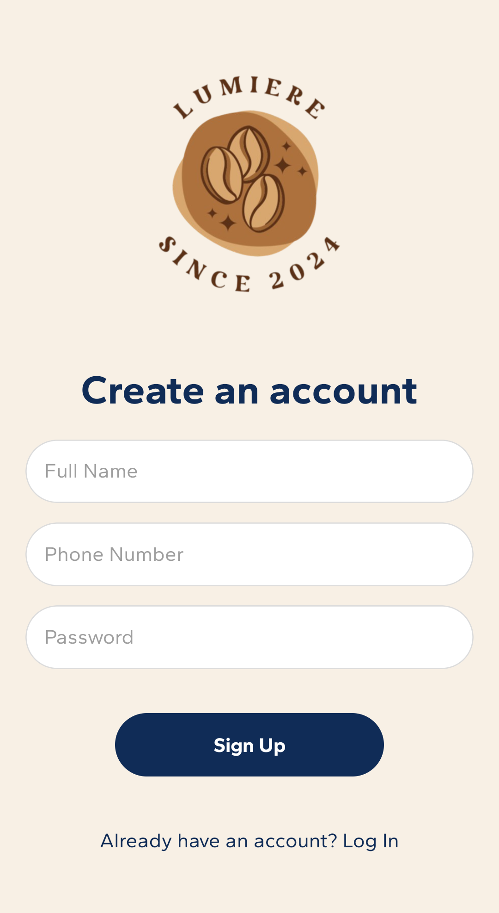
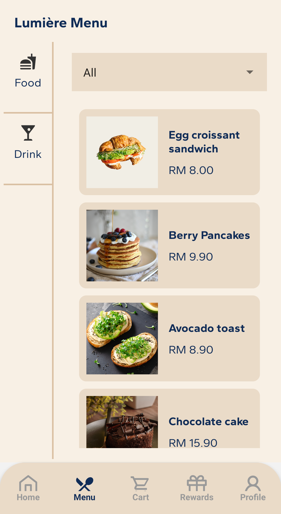
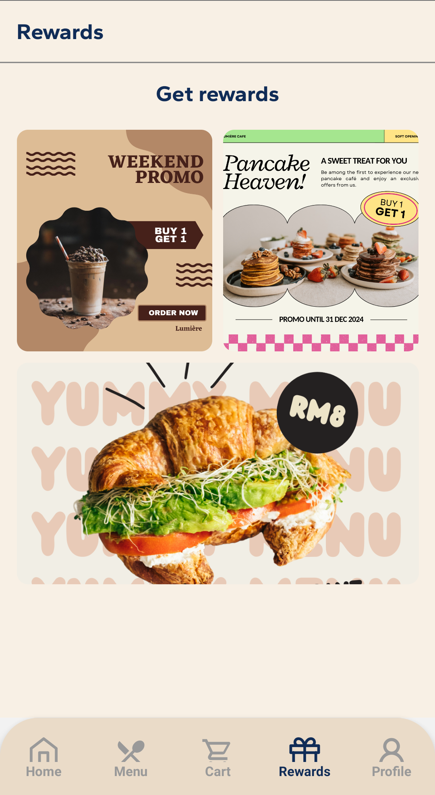
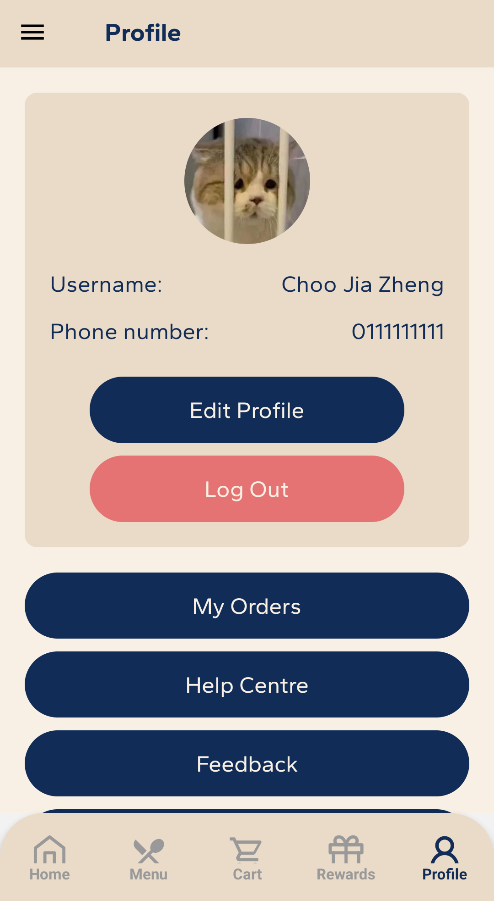

<p align="center">
  <a href="" rel="noopener">
 </a>
</p>
<h1 align="center">Lumière</h1>

<p>The Lumière Café Ordering Application is a user-friendly mobile application designed to streamline the process of ordering foods and beverages from Lumière Café.</p>

<h2 align="center">🚀 Getting Started</h2>

Install necessary dependencies > Start the Metro Server and the Application

```bash
# Install dependencies
npm install

# Start Metro server and the application
npx react-native run-android
```

If everything is set up _correctly_, you should see your the app running in your _Android Emulator_ shortly provided you have set up your emulator/simulator correctly.

This is one way to run your app — you can also run it directly from within Android Studio.

<h2 align="center">📱 Mobile Application Design</h2>
<div style="display:flex;">
  
  
  
  
  
  
  
  
</div>

<h2 align="center">👨‍💻 Contributor</h2>

<p>The Lumière Café Ordering Application is developed by a team of Software Engineering students from UTAR. Feel free to visit their GitHub Profiles below!
<ul>
   <li><a href="https://github.com/Zoriannn">Choo Jia Zheng</a></li>
   <li><a href="https://github.com/linnlms">Leong Ming Shan</a></li>
   <li><a href="https://github.com/cathyloke">Loke Weng Yan</a></li>
   <li><a href="https://github.com/joelytin">Tin Hui Hui</a></li>
</ul>

